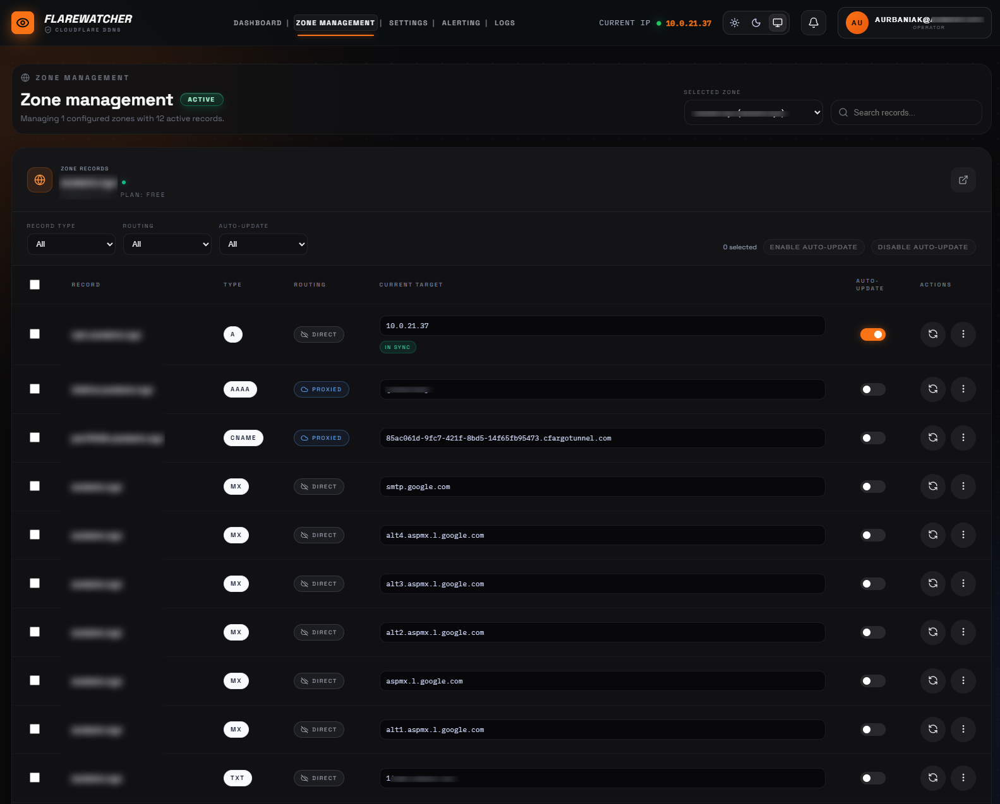

# Flarewatcher

> [!WARNING]
> Flarewatcher is **vibecoded** software. It is built with care, but it has not been battle-tested like a commercial DNS control plane. Review the code, keep backups, and **use it at your own risk**.

<p align="center">
  
  
  
  
  
  
</p>

<p align="center">
  <strong>A self-hosted Cloudflare DDNS and DNS operations dashboard.</strong>
</p>

<p align="center">
  Track your public IP, manage Cloudflare zones and records, automate DNS updates, receive alerts, and keep an audit trail from one clean web UI.
</p>

<p align="center">
  
</p>

---

## What It Does

Flarewatcher is a small control room for people who run DNS through Cloudflare and want more visibility than a background script can provide. It combines dynamic DNS updates, Cloudflare record management, alerting, rollback history, authentication, and operational logs into a single self-hosted Next.js app.

It is especially useful when you want to keep one or more Cloudflare DNS records pointed at your current public IP while still being able to see what changed, when it changed, and whether anything failed.

## Highlights

| Area | What Flarewatcher gives you |
| --- | --- |
| **DNS operations** | Browse Cloudflare zones, inspect records, and update DNS from the dashboard. |
| **Dynamic DNS** | Detect the current public IP and use it in DNS update workflows. |
| **Monitoring** | Select records to monitor and refresh them on a configurable interval. |
| **Bulk actions** | Apply record actions faster when managing multiple entries. |
| **Rollback history** | Restore previous DNS values from stored update history. |
| **Alerting** | Send notifications through Discord webhooks, SMTP email, and Telegram settings. |
| **Logs** | Review system activity, DNS update history, and user audit events. |
| **Security** | Session auth, optional 2FA, encrypted stored secrets, rate limiting, origin checks, and secure cookie handling. |
| **Self-hosting** | Run it with Docker Compose or develop locally with Node.js and SQLite. |

## App Sections

- **Dashboard** - quick access to zones, settings, alerting, logs, current public IP, notifications, and command palette actions.
- **Zone management** - Cloudflare zone and DNS record browsing, sync state, update controls, and monitored record workflows.
- **Settings** - Cloudflare token storage, token access checks, refresh interval, profile, password, and security controls.
- **Alerting** - notification destinations and message templates for IP changes and failures.
- **Logs** - DNS updates, rollback data, system events, and audit activity.

## Quick Start With Docker

1. Copy the example environment file:

```bash
cp .env.example .env
```

2. Set a strong encryption key:

```bash
SECRET_ENCRYPTION_KEY=replace-with-a-long-random-secret
```

3. Start the app:

```bash
docker compose pull
docker compose up -d
```

Flarewatcher will be available at:

```text
http://localhost:3000
```

The Docker Compose setup stores SQLite data in the `flarewatcher-data` volume and runs the container with `restart: unless-stopped`.

## Local Development

Requirements:

- Node.js 20+
- npm

Run:

```bash
npm install
cp .env.example .env
npm run prisma:generate
npm run prisma:db
npm run dev
```

Then open:

```text
http://localhost:3000
```

## Environment

```bash
# Local development default
DATABASE_URL=file:./prisma/flarewatcher.db

# Docker / Kubernetes default
# DATABASE_URL=file:/app/data/flarewatcher.db

SECRET_ENCRYPTION_KEY=replace-with-a-long-random-secret
```

`SECRET_ENCRYPTION_KEY` protects stored secrets such as Cloudflare tokens and notification credentials. Use a long, random value and keep it stable for the lifetime of the instance.

## Cloudflare Token Notes

Create a Cloudflare API token with only the permissions your instance needs. For typical DNS management, start with zone read access and DNS edit access for the zones you want Flarewatcher to manage.

After adding a token in the app, use the built-in access checks to confirm scopes and identify missing permissions.

## Security Notes

Flarewatcher includes several safety-minded features:

- Password-based login with server-side sessions
- Optional two-factor authentication
- Encrypted secret storage
- Rate limiting on sensitive routes
- Origin checks for protected requests
- Secure cookie handling in production
- User audit events for important actions

This does not make it a hardened enterprise product. Put it behind HTTPS, restrict network access where possible, keep the container updated, and review changes before trusting it with important DNS zones.

## Useful Scripts

```bash
npm run dev                 # Start the Next.js dev server
npm run build               # Build the production app
npm run start               # Start a built Next.js app
npm run start:prod          # Run migrations, then start production
npm run lint                # Run ESLint
npm run prisma:generate     # Generate Prisma client
npm run prisma:db           # Push Prisma schema in local development
npm run prisma:migrate      # Deploy Prisma migrations
npm run security:audit      # Check fixable npm audit results
```

## Versioning

- Release source of truth: **Git tags**
- Tag format: `vMAJOR.MINOR.PATCH` such as `v1.0.0`
- Runtime version source:
  - Release images use the CI-generated GitHub tag
  - Local and non-CI builds fall back to `package.json`

Helpful version commands:

```bash
npm run version:resolve
npm run version:resolve:tag
```

## License

MIT. See [`LICENSE`](LICENSE).
